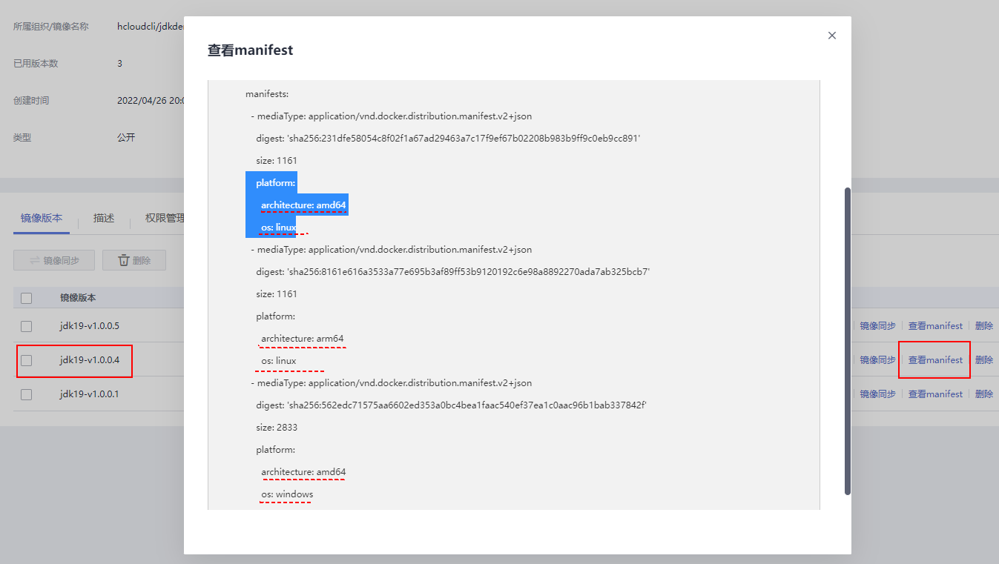

# swr-multiplatform-build-action
允许用户构建跨平台镜像,如linux平台，windows平台或macos平台，并可以直接推送到SWR等Docker镜像仓库上  
目前支持的平台列表如下  
```yaml
  'linux/amd64',
  'linux/arm64',
  'linux/ppc64le',
  'linux/s390x',
  'linux/386',
  'linux/arm/v7',
  'linux/arm/v6',
  'linux/arm64/v8',
  'windows/amd64',
  'windows/arm64',
  'darwin/amd64',
  'darwin/arm64'
```

## **前置工作**
(1).如果需要推送到SWR等Docker registry上，需要添加一个docker login的action，添加好登录账号密码等信息    
(2).需要确定基础镜像支持的平台  
如19-jdk,支持windows/amd64,linux/amd64,linux/arm64/v8 这三个平台,  


## **参数说明:**
imagetag:需要打包的docker镜像标签，如   swr.cn-north-4.myhuaweicloud.com/hcloudcli/jdkdemo:jdk19-v1.0.0.4  
platforms: 当前需要打包支持的平台，用逗号隔开，如  linux/amd64,linux/arm64/v8,windows/amd64  
file: Dockerfile路径，默认为Dockerfile,如果在其他目录，则填写相对路径,如 ./docker-v1.0.0.1/Dockerfile  
uselatestbuildx: 是否需要使用最新版本的docker buildx来构建docker镜像  
push: 是否需要将构建好的镜像推送到docker镜像仓库，如果填true，需要再前面增加一个docker login的  action完成镜像仓库的登录  

## **使用样例**
为docker镜像添加 linux/amd64,linux/arm64/v8,windows/amd64 平台支持  
```yaml
      - uses: huaweicloud/swr-login@v1
        name: Login to HuaweiCloud SWR
        with:
          region: cn-north-4
          access-key-id: ${{ secrets.ACCESSKEY }}
          access-key-secret: ${{ secrets.SECRETACCESSKEY }}
          
      - uses: huaweicloud/swr-multiplatform-build-action@v1.0.0
        name: "build docker image for multiplatform"
        with:
         image_tag: swr.cn-north-4.myhuaweicloud.com/hcloudcli/jdkdemo:jdk19-v1.0.0.4
         platforms: linux/amd64,linux/arm64/v8,windows/amd64
         use_latest_buildx: false
         push: true
         file: ./Dockerfile
```
## **查看结果**
登录华为云SWR服务，查看hcloudcli/jdkdemo:jdk19-v1.0.0.4镜像的manifast内容  
```yaml
digest: sha256:e4090ef801d8240bf6dc0ff878a39cad98eaf1e811cf8a4307171588065d291c
manifest详情：
mediaType: application/vnd.docker.distribution.manifest.list.v2+json
schemaVersion: 2
manifests:
  - mediaType: application/vnd.docker.distribution.manifest.v2+json
    digest: 'sha256:231dfe58054c8f02f1a67ad29463a7c17f9ef67b02208b983b9ff9c0eb9cc891'
    size: 1161
    platform:
      architecture: amd64
      os: linux
  - mediaType: application/vnd.docker.distribution.manifest.v2+json
    digest: 'sha256:8161e616a3533a77e695b3af89ff53b9120192c6e98a8892270ada7ab325bcb7'
    size: 1161
    platform:
      architecture: arm64
      os: linux
  - mediaType: application/vnd.docker.distribution.manifest.v2+json
    digest: 'sha256:562edc71575aa6602ed353a0bc4bea1faac540ef37ea1c0aac96b1bab337842f'
    size: 2833
    platform:
      architecture: amd64
      os: windows
 ```
 效果如下
 
 
 ## **镜像使用:**
 在linunx或者windows的x86-64平台或者linux的arm-64平台，直接docker pull这个镜像，docker会自动下载对应平台的镜像  
### 1、linux x86-64平台

### 2、linux arm-64平台:
 
###  3、windows x86-64平台 
 